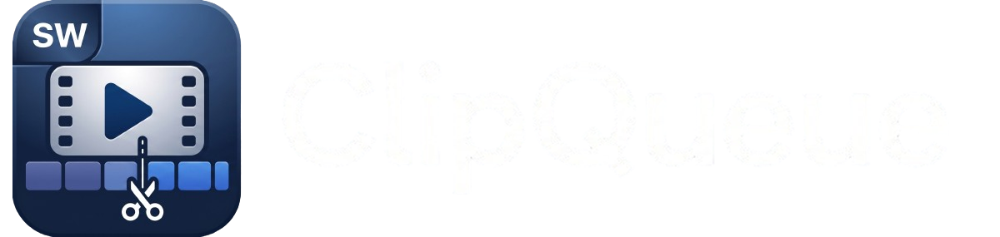
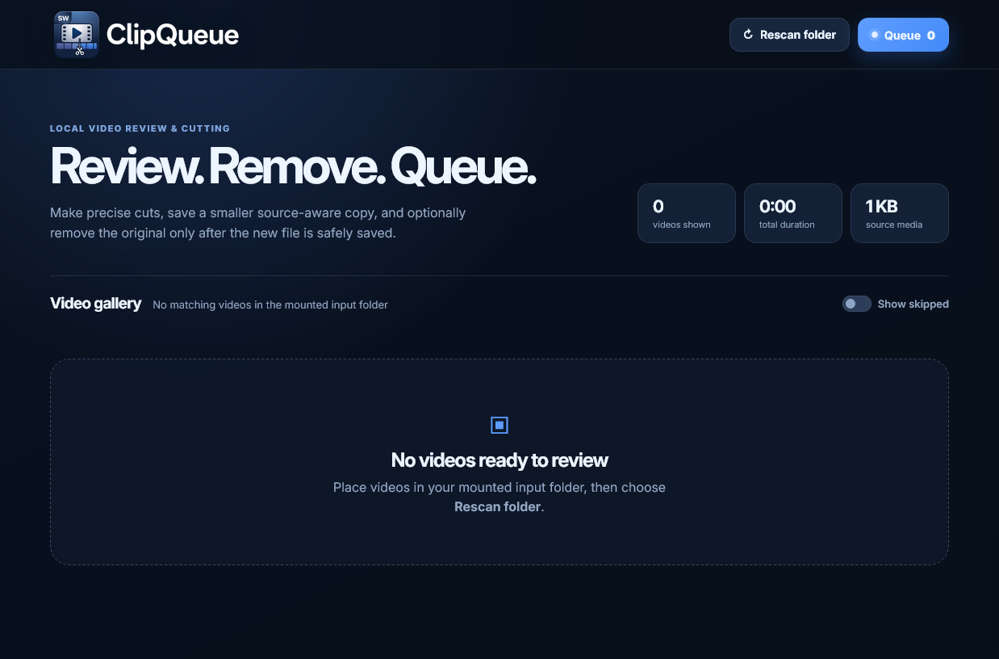

<!-- version 1.2.0 -->
<p align="center">
  
</p>

# ClipQueue

**ClipQueue** is a self-hosted Docker web application for reviewing videos, removing a chosen time range, and processing edits through a persistent FFmpeg queue. It is designed for Ubuntu hosts where your original and completed videos remain in normal folders on the host machine.

<p align="center">
  <a href="https://www.swakes.co.uk">SWAKES</a> · <a href="https://github.com/pqpxo/clipqueue">GitHub</a>
</p>

<details> <summary><strong>Screenshot</strong></summary> <br> <p align="center"> <a href="clipqueue_screenshot.png">  </a> </p> </details>

## Features

- Scan a host-mounted **input** folder into a video gallery.
- Preview each clip and remove a segment with sliders, numeric inputs, or the current playhead.
- Review videos one-by-one with **Previous**, **Skip video**, and **Queue cut & next** controls.
- Persistent SQLite-backed queue that continues after a container restart.
- **Clear queue** action to remove queue/history entries without deleting media files.
- Frame-accurate FFmpeg processing with H.264 CRF 23 and AAC output for MP4-style exports.
- Two-pass output-size safeguard when a CRF export would otherwise exceed the source size target.
- Output validation, including opening-frame decode checks to catch unhealthy exports.
- Delete sources directly in the gallery or automatically after a verified output has been saved.
- Custom ClipQueue branding, browser icon, and SWAKES/GitHub footer links.

> [!WARNING]
> ClipQueue can permanently delete files from the input folder when you choose **Delete** or leave **Delete original after successful save** enabled. Keep backups of any media you need to retain.

## Requirements

- Ubuntu or another Linux host with Docker Engine and Docker Compose v2.
- An account permitted to run `docker compose`.
- Enough storage for source files, temporary processing files, and final output.

## Quick start

Clone the repository, then run the bundled setup script:

```bash
# version 1.2.0
git clone https://github.com/pqpxo/clipqueue.git
cd clipqueue
bash ./scripts/setup.sh
```

The script creates `media/input`, `media/output`, and `data`; writes your host UID/GID and absolute volume paths to `.env`; then builds and starts ClipQueue.

Open the portal at:

```text
http://YOUR-UBUNTU-HOST-IP:8097
```

To view logs:

```bash
# version 1.2.0
docker compose logs -f
```

To stop ClipQueue:

```bash
# version 1.2.0
docker compose down
```

## Folder layout

```text
clipqueue/
├── app/                     # FastAPI backend and browser UI
├── docker/                  # Container entrypoint
├── scripts/                 # First-run setup script
├── data/                    # Runtime database, thumbnails, temporary files
├── media/
│   ├── input/               # Source videos to review
│   └── output/              # Completed edited videos
├── .env                     # Local configuration — do not commit
├── docker-compose.yml
└── README.md
```

All videos remain in normal host folders. Docker uses bind mounts, so input and output files remain accessible outside the container.

## Configuration

Copy `.env.example` to `.env` when configuring manually:

```bash
# version 1.2.0
cp .env.example .env
```

Key values:

| Variable | Purpose | Default |
|---|---|---|
| `INPUT_DIR` | Host folder containing source videos | `./media/input` |
| `OUTPUT_DIR` | Host folder for completed videos | `./media/output` |
| `DATA_DIR` | Host folder for database and thumbnails | `./data` |
| `PUID` / `PGID` | Ubuntu user and group IDs used by the container | `1000` / `1000` |
| `APP_PORT` | Web portal port | `8097` |
| `MAX_OUTPUT_SIZE_RATIO` | Preferred maximum output/source size ratio | `0.98` |

For custom host locations, use absolute paths. Example:

```dotenv
# version 1.2.0
INPUT_DIR=/mnt/media/to-review
OUTPUT_DIR=/mnt/media/edited
DATA_DIR=/home/your-user/docker/clipqueue/data
PUID=1000
PGID=1000
APP_PORT=8097
MAX_OUTPUT_SIZE_RATIO=0.98
```

Apply configuration changes with:

```bash
# version 1.2.0
docker compose up -d --build --force-recreate
```

## Typical workflow

1. Copy source videos into `media/input`.
2. Open ClipQueue and choose **Rescan folder**.
3. Select a video from the gallery.
4. Choose the section to remove. New edits default to **0.0–5.0 seconds**.
5. Leave **Delete original after successful save** enabled to remove the source only after output validation, or untick it to retain the original.
6. Choose **Queue cut & next**.
7. View progress through **Queue**. Finished videos appear in `media/output`.

## Video quality and file size

ClipQueue prioritises dependable, accurate cuts rather than keyframe-only copying:

- Standard MP4-style output uses **H.264 CRF 23** plus **AAC 128 kbps**.
- If that result exceeds the configured size target, ClipQueue uses a two-pass H.264 fallback.
- The default size target is **98%** of the source file size. This is a practical target, not an absolute guarantee for every codec/container combination.
- Finished outputs are checked by FFmpeg before the queue marks them complete.

## Supported formats

The gallery scans common video extensions including MP4, M4V, MOV, MKV, WEBM, AVI, MPG/MPEG, TS/M2TS, MTS, and 3GP. Browser playback depends on your browser and the underlying codec; H.264/AAC MP4 typically gives the best preview compatibility.

## Safety and network access

- ClipQueue does **not** overwrite source files.
- The input folder is writable only to support the requested delete actions.
- Output files are saved separately under the configured output folder.
- The app has no built-in login/authentication. Keep it on a trusted LAN or place it behind an authenticated reverse proxy before exposing it elsewhere.

## Updating an existing installation

Back up `.env`, `data`, `media/input`, and `media/output`. Then replace only the application files with the new release contents. Keep your existing media/data folders, restore your `.env`, and rebuild:

```bash
# version 1.2.0
docker compose up -d --build --force-recreate
```

## Troubleshooting

### A video does not appear in the gallery

Run a rescan, then confirm the container sees the mounted files:

```bash
# version 1.2.0
docker compose exec -T clipqueue ls -lah /media/input
```

### The app cannot create thumbnails or output files

Confirm `PUID` and `PGID` are your current user values:

```bash
# version 1.2.0
id -u
id -g
```

Then ensure `data` and `media/output` are owned by that user and recreate the service:

```bash
# version 1.2.0
sudo chown -R "$(id -u):$(id -g)" data media/output
docker compose up -d --build --force-recreate
```

### Get application logs

```bash
# version 1.2.0
docker compose logs -f --tail=200
```

## Release notes

See [CHANGELOG.md](CHANGELOG.md) and [RELEASE_NOTES_v1.2.0.md](RELEASE_NOTES_v1.2.0.md).
